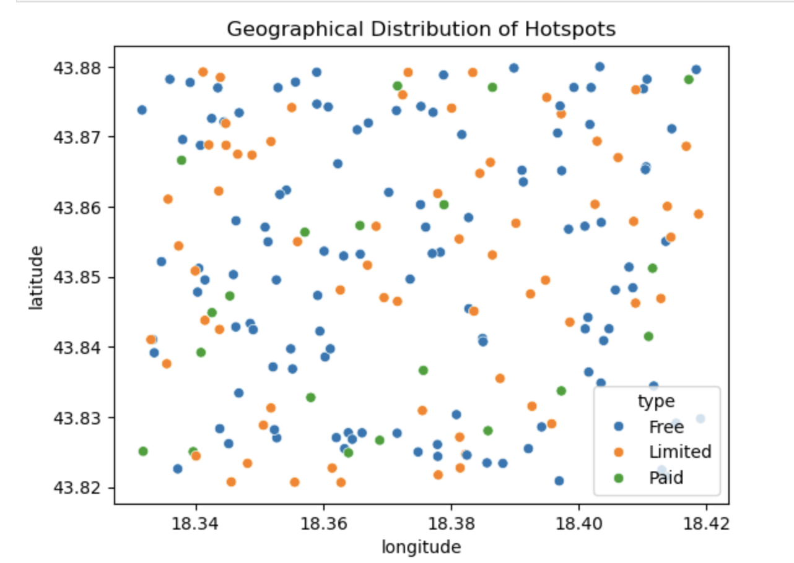
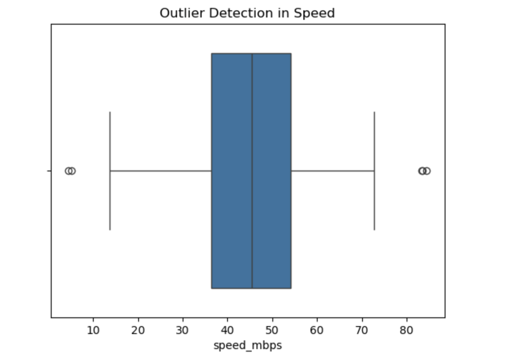

# 📶 Wi-Fi Hotspot Data Analysis

This project focuses on analyzing Wi-Fi hotspot data to discover patterns,
trends, and insights using Python and data analysis techniques.

---

## 📊 Project Overview

The main goal of this project is to explore public Wi-Fi hotspot usage and
availability, and understand how it varies across different locations and
time periods.

---

## 📁 Dataset

- Source: Public Wi-Fi hotspot dataset
- Format: CSV
- Records: Multiple locations and usage data

---

## ⚙️ Technologies Used

- Python
- Pandas
- NumPy
- Matplotlib
- Seaborn
- Jupyter Notebook

---

## 🔍 Analysis Steps

1. Data loading and inspection
2. Data cleaning and preprocessing
3. Exploratory Data Analysis (EDA)
4. Visualization of key trends
5. Interpretation of results

---

## 📌 Key Insights

- Most Wi-Fi hotspots are concentrated in central neighborhoods.
- Average connection speed ranges between 40–60 Mbps.
- A few extreme outliers (above 800 Mbps) were detected.
- Free hotspots are more widely available than paid ones.
- No missing values were found in the dataset.


---

## 🖼 Sample Visualizations

### 📊 Distribution of Wi-Fi Speed


### 🏙️ Hotspots per Neighborhood


### 🌍 Geographical Distribution of Hotspots


### 📦 Outlier Detection in Speed



---

## ▶️ How to Run

````md

1. Clone the repository:
```bash
git clone https://github.com/semihaseker/Wi-Fi-Hotspot-Data-Analysis.git
````

2. Install dependencies:

```bash
pip install -r requirements.txt
```

3. Open the notebook:

```bash
jupyter notebook
```

4. Run `AID_Project.ipynb` in your browser.

---

## 🎯 Future Improvements

- Build an interactive dashboard
- Add predictive modeling
- Include more datasets
- Deploy using Streamlit

---

## 👩‍💻 Author
  Semiha Şeker
🔗 GitHub: https://github.com/semihaseker  

Hana Bubalo

